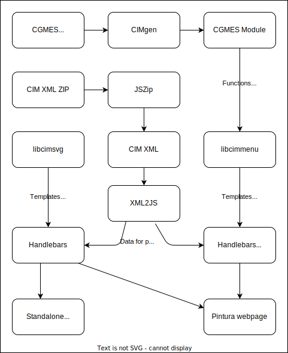

# Developing on Pintura

## How does it work?

Here is a diagram of how the software components interact:

There are 3 libraries that are loaded to make pintura work:

### Cimsvg

+ Graphical representation of power grids (the main diagram)

+ Selection of components in the diagram for display in the menu

+ Changing the location of a component in the diagram

### Cimmenu

+ Showing a list of the components grouped by type

+ Showing / editing attributes for each component

+ Adding new components to the diagram

+ Adding new diagrams and selecting which diagram to work on

+ File actions (importing and exporting models)

   * Multi-profile zip file

   * Single XML file containing all profiles

   * Exporting to an SVG file (picture of the grid)

### Cgmes

+ Rendering the components as a list of attributes (when the component is selected to be displayed in the menu)

+ Rendering the components as a member of a list of attributes (when the component is one of the attributes in a component that has been selected to be displayed in the menu)

+ Deciding whether a component belongs in a profile or not (for file export)

