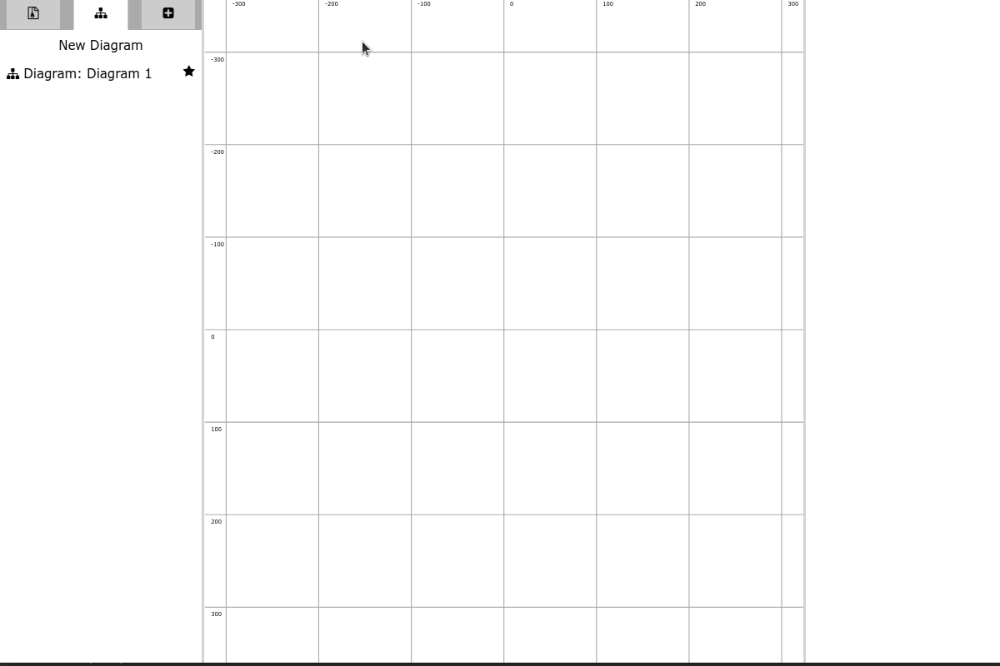
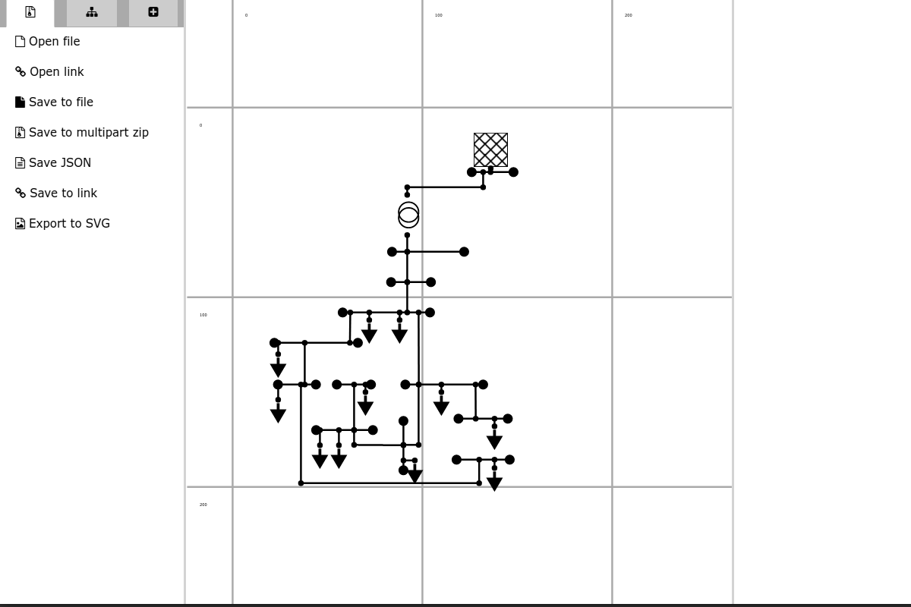

# Pintura Manual

## How do I..

### How do items connect?

### Create a new network diagram

Select the diagram tab. This is the middle tab in the left hand panel.
Then click the "New Diagram" button.

### Add a topological node to a network

Select the components tab. This is the right hand tab in the left hand panel.
Select your diagram from the dropdown, then click on "Topological Node".
Move your pointer over the network diagram and you will see that it has changed to indicate
that a topological node will be added when you click. Click on the diagram where you want
to place it.

### Join two topological nodes that form part of a network

Add two topological nodes to the diagram. Then add an AC Line Segment to the diagram.
This will be used to connect the two topological nodes. In the diagram menu, open the terminal
component list and select the terminal called "cim:ACLineSegment1-terminal1". The attributes
for the terminal will de displayed in the right hand menu. Change the "TopologicalNode"
node attribute to the topologicalnode called "cim:TopologicalNode1". Then go back to the diagram
tab and select the terminal called "cim:ACLineSegment-terminal2". Change the "TopologicalNode"
attribute to "cim:TopologicalNode2".

### Add a new component to the network and connect it to a topological node

Select the add component tab (right-hand tab in the left-hand panel). Click on the EnergyConsumer,
PowerTransformer or SynchronousMachine buttons. When you move your pointer over the main diagram it
will show an icon of the component you chose, to indicate which type of component will be added.
Click on the diagram in the place you wish to put the component. We then need to associate the
component's terminal with the topological node that it should be connected to. Show the terminal's
attributes, either by clicking on the terminal or selecting it in the diagram menu. Select the
topological node from the "cim:TopologicalNode" attribute dropdown menu. 

### Adding a terminal to a component

Once you have added the component, add a terminal and place it adjacent to the component you wish
to add it to. Then find the terminal in the diagram menu and update the "ConductingEquipment"
attribute to the component you are adding the terminal to. The terminal will now follow the
component if you move the component somewhere else on the grid.

### Changing the name of a component

When the attributes for a component are displayed in the attributes (right-hand) panel, it is
possible to update them. In the example below the name of a terminal is changed to fit the
convention used for the other terminals. Do not change the mRID value, because this will corrupt
links in the CIM file.

### Adding a new diagram and selecting which is visible.

From the diagrams tab (middle of the left-hand pane) click on the "New Diagram" button.
To show or hide the diagram, click on the star next to the diagram name.

### Pan and zoom

The arrow keys will move the viewing field around the diagram. Holding Ctrl (Strg) and using the
up and down keys will zoom in and out. It is also possible to drag the grid using the pointer.

### Deleting a component

Right-click on a component to show the delete option. You will also need to delete the terminals
if you don't want them any more.

### Open an existing CIM file

Make sure the file tab is selected and click "Open file".
Then use the file dialog to select the files you wish to open.

### Save the network to a multi-profile zip file

On the file menu, select save file, then use the file dialog to choose
where to save the file.

