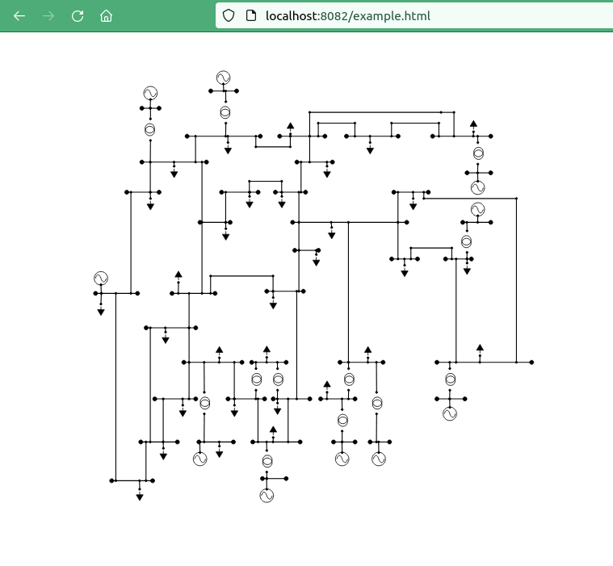

## Using Libcimsvg in other projects

### How do I include a diagram in my web page?
The html below is demonstration code to show how libcimsvg can be used to show a
graphical representation of a model in a web page. The easiest way to try this out is:

```bash
$make dev && make start
```

Then navigate to http://localhost:8082/example.html

```html
<!DOCTYPE html>
<html>
        <head>
                <meta charset="UTF-8">
                <title>Simple Pintura Integration</title>
        </head>
        <body>
                <style>
                        .grid {
                                display: none;
                        }
                        .backing {
                                fill: transparent;
                        }
                </style>
                <div id=svg-panel>
                        <svg id="cim" width="800" height="600">
                                <rect class="backing" />
                                <g class="grid" />
                                <g class="diagrams" />
                        </svg>
                </div>
                <script type="text/javascript" src="https://cdnjs.cloudflare.com/ajax/libs/handlebars.js/4.7.6/handlebars.runtime.min.js"> </script>
                <script type="text/javascript" src="https://cdnjs.cloudflare.com/ajax/libs/jszip/3.2.0/jszip.min.js"> </script>
                <script type="text/javascript" src="https://sogno.energy/pintura/dist/libcimsvg.js"></script>
                <script language="javascript" type="text/javascript">
                        var currentCimsvg = libcimsvg.currentCimsvg;
                        var svg = document.getElementById("svg-panel");
                        var cimsvg = libcimsvg.cimsvg;
                        var cimsvgInstance = new cimsvg(svg);
                        cimsvgInstance.downloadUri("http://localhost:8082/example.zip");
                        cimsvgInstance.fit();
                </script>
        </body>
</html>
```

#### What will it look like?

The grid and the backing colour are disabled in the <style> tags.
While it is not possible to show the attributes without the menu, hovering over
a component will reveal the component's name.


